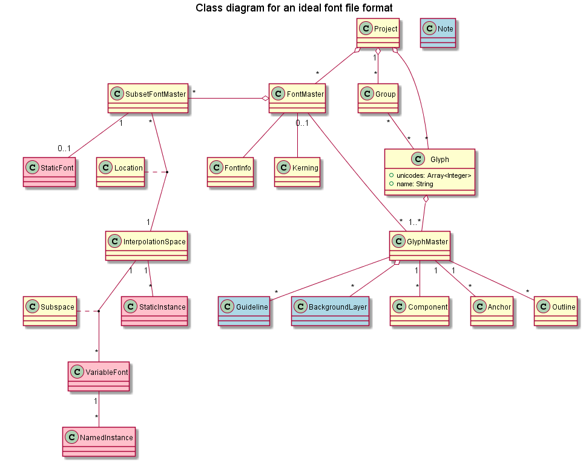

# Ideal font file format

## Data to store

The file format should contain:
* source information that makes it into the final font files
* process information such as background layers, guidelines, comments,
font editor extension data, etc... that doesn't impact the final font files
* definitions of the possible outputs to build from the sources, e.g.
interpolated instances, static fonts, variable fonts, etc...

Notes about defining the outputs in the file format

Aainst:
> I don't like having the outputs defined in the source file format because
it's more of a job for a build system. Like in C, that's the source, and the
Makefile that makes the executable, that's the build system.

For:
> Some of the source information needs to be mixed into one of those outputs,
e.g. extra TTX dumps to merge into the final fonts (that's how we handle
hinting at Dalton Maag at the moment). If the source format doesn't define
possible outputs from the sources, then it's not possible to know where
that extra information is supposed to go.

The source information contains 2 types of data: interpolatable and discrete.

TODO: improve diagram

## Existing file formats

### UFO + Designspace

https://github.com/fonttools/fonttools/tree/master/Doc/source/designspaceLib

http://superpolator.com/pages/designspace.html

http://unifiedfontobject.org/

Pros:
* works for us at the moment
* good portability
* good support as an interchange format
* mostly Git-friendly
* good support for variable font use-cases

Limitations:
* evolves slowly
* awkward support for brace layers and bracket layers (in which UFO to put the outlines?) <- not sure about that one?
* kerning should be visual
* glyphs inside layers duplicates information about glyphs

### Glyphs.app

https://github.com/schriftgestalt/GlyphsSDK/blob/master/GlyphsFileFormat.md

Pros:
* Layers inside glyphs makes more sense than UFO
* supports nices features of Glyphs.app

Limitations:
* not an interchange format, very Glyphs.app-specific
* questionable customisations to the base ASCII plist format
* changes often and unilaterally
* one file, not very Git-friendly

### FontLab VI VFJ

TODO: check it out

### Trufont/TFont

https://github.com/trufont/tfont

Looks a lot like Glyphs.

## Existing proposals

TODO: find links to other existing proposals for improvement, from Adam and Georg in particular.

### UFS (Unified Font Set)

http://unifiedfontobject.org/roadmap/

### Other font sets

https://github.com/unified-font-object/ufo-spec/issues/86

https://github.com/robotools/fontParts/issues/424

### Runebender

TODO: check it out

https://docs.google.com/document/d/1NBeSGmNWQVgvxZT5zZxPMbm_6yVFZaq7fNwqO_fKFbE/edit#heading=h.g395u5g50i99

https://raphlinus.github.io/

## Proposed class diagram (work in progress)

